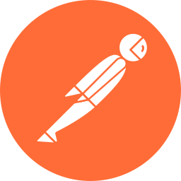

## Hi there, my name is Eduard 👋
### My Stack :
<table align="center">
<tr>
<td align="center" width="88">

 HTML5
</td>
<td align="center" width="88">

 CSS3
</td>
<td align="center" width="88">

 JavaScript
</td>
<td align="center" width="88">

 TypeScript
</td>
<td align="center" width="88">

 React.js
</td>
<td align="center" width="88">

 Next.js
</td>
</tr>
<tr>
<td align="center" width="88">

 Node.js
</td>
<td align="center" width="88">

 SQL
</td>
<td align="center" width="88">

 Postman
</td>
<td align="center" width="88">
 
 Sass
</td>
<td align="center" width="88">

 Docker
</td>
  <td align="center" width="88">

 Python
</td>
</tr>
</table>

### Connect with me:

&nbsp;&nbsp;

&nbsp;&nbsp;

&nbsp;&nbsp;

&nbsp;&nbsp;

<!--
**EddNik/EddNik** is a ✨ _special_ ✨ repository because its `README.md` (this file) appears on your GitHub profile.

Here are some ideas to get you started:

- 🔭 I’m currently working on ...
- 🌱 I’m currently learning ...
- 👯 I’m looking to collaborate on ...
- 🤔 I’m looking for help with ...
- 💬 Ask me about ...
- 📫 How to reach me: ...
- 😄 Pronouns: ...
- ⚡ Fun fact: ...
-->
